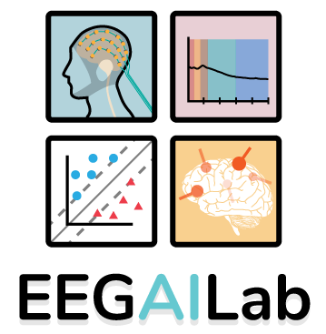
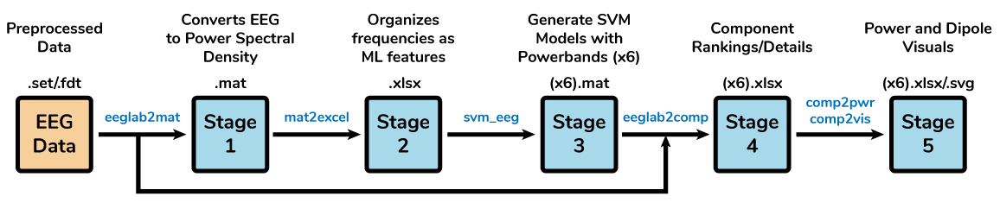
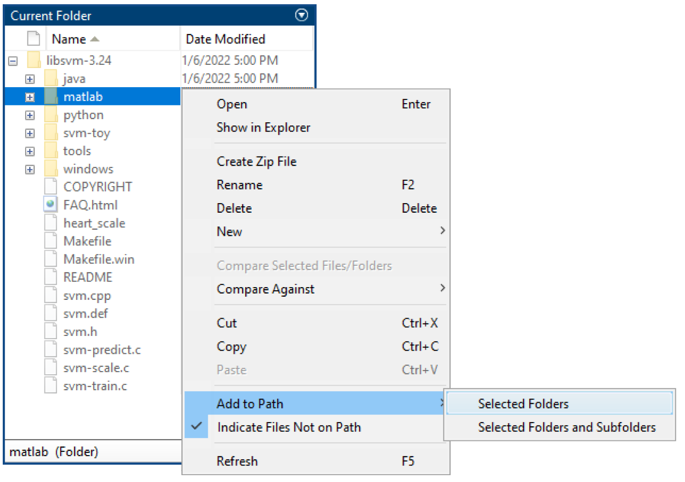
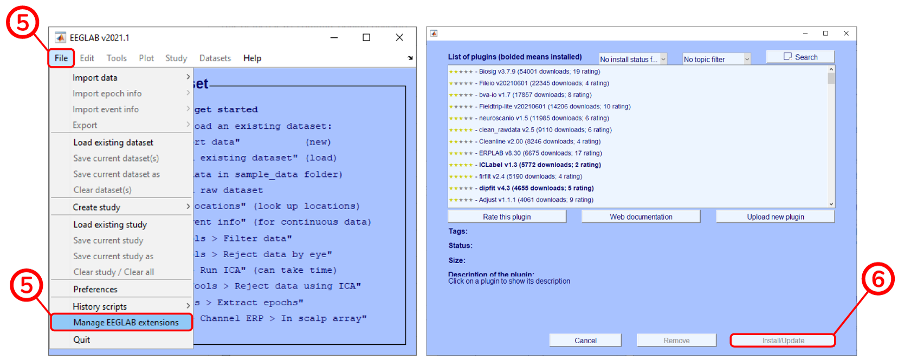
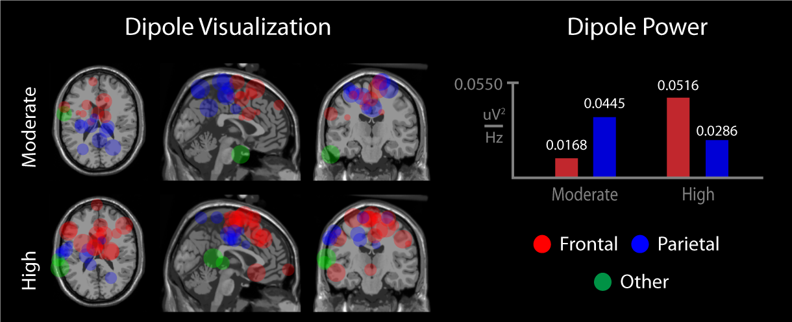

<p align="center">
  
</p>

## About The Project
EEGAILab is a novel machine learning framework designed to analyze and visualize dipole sources from resting electroencephalography data. This analysis uses spectrum analysis and machine learning to capture key frequencies and dipole sources that contribute to classifying specified groups.

For example, we apply this framework to predict long-term treatment outcomes of spinal cord stimulation for patients with chronic lower back pain. We differentiate and show two groups of patients that have undergone spinal cord stimulation. Listed under the expected outputs we show example outputs of our framework including dipole maps and power (uV^2/Hz) differences. In this example, this framework will be able to provide clinicians with a non-invasive technique to predict which patients respond the best to spinal cord stimulation. Below is a figure detailing the multi-stage framework.

<p align="center">
  
</p>

Each stage (1-5) has an intermediate output in the `processed_data` folder. The details and input/output of each stage is listed below.
- **<u>EEG Data</u>:** This folder expects preprocessed EEG data. This data requires independent component analysis (ICA) including selection of components and to have been fitted with dipoles. Our example application has been bandpassed from 1-100Hz and truncated into 6 second epochs.

- **<u>Stage 1</u>:** EEG data is first converted to the power spectral density (PSD) with units uV^2/Hz using a fourier transform within EEGLAB. Each whole number frequency (i.e. 1Hz, 2Hz, 3Hz, ...) will be used as a feature in the machine learning algorithm. Data is then saved as a .mat file to speed up computations and accessibility.

- **<u>Stage 2</u>:** The PSD is organized into an excel sheet where rows are subjects and columns are single frequencies to make it easily readable for machine learning. Each data point is the power in uV^2 at that frequency.

- **<u>Stage 3</u>:** SVM models are generated using the frequencies as features. A total of 6 models are made according to the powerbands: `All: 1-100Hz`, `Delta: 1-4Hz`, `Theta: 4-8Hz`, `Alpha: 8-13Hz`, `Beta: 13-30Hz`, and `Gamma: 30-100Hz`. For example, the beta powerband model will only have frequencies 13 to 30Hz. SVM models are trained with a default of 10 iterations of 3-fold cross-validation. This can be changed in `main.m`.

- **<u>Stage 4</u>:** A detailed spreadsheet is compiled about each component's XYZ coordinates in MNI space, location in brain region (hemisphere, lobe, and gyrus), and residual variance. A ranking system was used to rank components based on feature weight and related power. The power, score, and rank of each component is also included.

- **<u>Stage 5</u>:** Power and dipole visuals are generated based on the top 10 ranked components from each subject. The components are the most important dipoles based on the SVM models. A power comparison between the groups is calculated onto an excel spreadsheet while the same dipoles are plotted on a standard MRI brain.

### Subdirectories
- `/data` Folder for pre-processed EEG data. Needs to be added.
- `/images` Images used in README.
- `/processed_data` Intermediate results of the pipeline organized by stages.
- `/src` Source code including functions, helper files, and toolboxes.

## Getting Started
### Prerequisites
The following is a list of items and links with how to install them. The framework will work the best with the specific version numbers. Plugins are installed with EEGLAB.
* [MATLAB 2019b](https://www.mathworks.com/products/matlab.html)
* [LIBSVM v3.24](https://github.com/cjlin1/libsvm/tree/v324)
* [EEGLAB v2021.1](https://github.com/sccn/eeglab/tree/eeglab2021.1)
* ICLabel v1.3.*
* dipfit v4.3.*
* SASICA v1.3.8.*

**EEGLAB Plugin*

### LIBSVM Installation
> Lab members can skip to **step 4** as the toolboxes are included in the Dropbox.
1. Navigate to the LIBSVM GitHub (v324) [link](https://github.com/cjlin1/libsvm/tree/v324).
2. **Download the ZIP** from the **Code** dropdown menu.
3. Create a folder named **toolbox** in the source folder and unzip LIBSVM.
```matlab
src/toolbox/libsvm-3.24
```
4. Add the LIBSVM matlab folder path by right-clicking the folder in MATLAB's directory and selecting `Add to Path > Selected Folders`

<p align="center">
  
</p>

* For Windows users, the required pre-built 64-bit mex file for `'svmtrain.mex'` is in `libsvm-3.24/windows/`
1. Copy `'svmtrain.mex'` to the matlab directory.
```matlab
libsvm-3.24/matlab/
```
* For Mac users, open MATLAB and navigate to the following LIBSVM folder as the current directory.
```matlab
 libsvm-3.24/matlab/
```
1. Type and run `>> make` in the Command Prompt. If it does not work, try `>> mex -setup` to choose a compiler for mex, then type `>> make` for installation. If problems persist refer to the README in the same folder.
2. Mex files `'libsvmread.mex'`, `'libsvmwrite.mex'`, `'svmtrain.mex'`, and `'svmpredict.mex'` should be built after a successful installation.

### EEGLAB (+Plugins) Installation
1. Navigate to the EEGLAB toolbox from the GitHub (eeglab2021.1) [link](https://github.com/sccn/eeglab/tree/eeglab2021.1).
2. **Download the ZIP** from the **Code** dropdown menu. (No plugins are included with this approach)
3. Open MATLAB and navigate to the EEGLAB folder as the current directory.
4. Type and run `>> eeglab` in the Command Prompt to add necessary paths and open EEGLAB.
5. To install plugins go to `File > Manage EEGLAB extensions`
6. Select a plugin and click the **Install/Update** button.
    - ICLabel v1.3.
    - dipfit v4.3.
    - SASICA v1.3.8.
<p align="center">
  
</p>

## Usage
Expected runtime: 5 minutes
1. Start MATLAB.
2. Navigate to the EEGAILab folder.
3. Create a `/data` folder and add preprocessed EEG data.
3. Open and run `main.m`.

> Lab members can skip **step 3** as there is an existing data set for validation.

The code can be run as is with preprocessed EEG data or can be adjusted for different testing settings. There are several adjustable variables in the main file which are listed below.

* **Subject IDs**: A vector of unique IDs for each subject. Ex. `[1,2,3,4,5]`
* **Binary Class Labels**: A vector of associated class labels as 1 and -1. Ex. `[1,-1,1,-1,1]`
* **Overwrite**: Overwrite data in stages 1-3 with 'Y' and keep data with 'N' when rerunning code. Ex. `'Y'`
* **Top Number of Components**: The number of components used per subject in a power comparison. Ex. `3`
* **SVM Parameters**
  * **N**: The number of iterations for cross-validation. *Default = `10`*
  * **n_fold**: The number of folds in cross-validation repeated *N* times. *Default = `3`*
  * **feature_sel**: Use feature selection `['N'/'Y']`. *Default = `'N'`*
  * **pval**: P-value for when feature selection is used. *Default = `1`*
  * **weight**: Type of weight used in ranking `['final'/'cv']`. *Default = `'final'`*

### Expected Outputs
Below is an example output when comparing spinal cord stimulation responders using several views (axial, coronal, sagittal) along with the power in uV^2/Hz. The dipole visualization represents the top 10 ranked dipoles from each subject as transparent circles separated by frontal (red) and parietal (blue) lobe. The larger and more opaque a circle the higher contribution it had in the machine learning algorithm. The dipole power shows the average power from the top 3 ranked dipoles from each subject within each group.

<p align="center">
  
</p>

## Roadmap
- [x] Add Changelog
- [ ] Add Component Selection Guide via EEGLAB

## Contact
For any questions, email **kylebsee@ufl.edu**

### For use in publications, please cite as:

Kyle B. See, Rachel Ho, Stephen Coombes, Ruogu Fang, “TL1 Team Approach to Predicting Response to Spinal Cord Stimulation for Chronic Low Back Pain”, Journal of Clinical and Translational Science, Mar 2021.

Kyle B. See, Rachel Louise Mahealani Judy, Stephen Coombes, Ruogu Fang, “TL1 Team Approach to Predicting Short-term and Long-term Effects of Spinal Cord Stimulation” Journal of Clinical and Translational Science, Jul 2020.

### Useful resources
* [ICLabel Component Labeling Practice](https://labeling.ucsd.edu/tutorial)

## Last Updated
January 7th, 2022